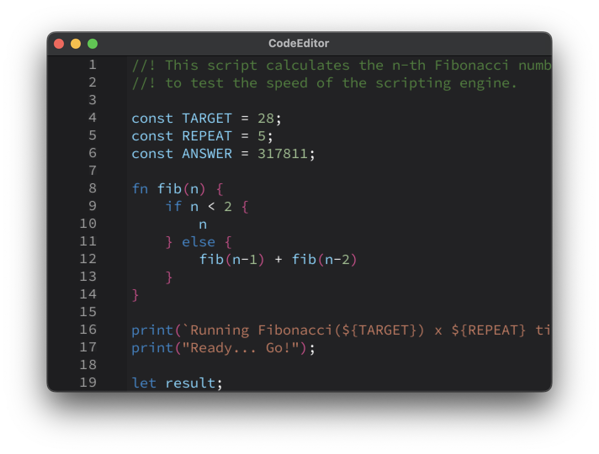

[](https://github.com/tterb/atomic-design-ui/blob/master/LICENSEs) [](https://shields.io/) [](https://twitter.com/EldironRPG)

# CodeEditor

A standalone code (and text) editor for people like me who write their own user interfaces utilizing crates like [pixels](https://github.com/parasyte/pixels).

CodeEditor renders its display into a ```Vec<u8>``` and is completely independent from any UI crate. It utilizes [fontdue](https://github.com/mooman219/fontdue) for rendering fonts.

## Example App

A standalone ```pixels``` and ```winit``` based example app is included in this repo.



## Usage

Add code_editor to your Cargo.toml

```
code_editor = "0.2.1"
```

And than in your app

```rust
use code_editor::prelude::*;

let mut code_editor = CodeEditor::new();
code_editor.set_font("fonts/Source_Code_Pro/static/SourceCodePro-Regular.ttf");
code_editor.set_mode(CodeEditorMode::Rhai);
code_editor.set_font_size(17.0);

code_editor.set_text("Your source code".to_string());
```

In your draw loop you can than draw the editor

```rust
code_editor.draw(frame, (0, 0, width, height), width);
```

The second parameter is the drawing rectangle into your frame, the last parameter is the stride in pixels.

You can get the edited text via ```get_text()```. You will also need to connect mouse and keyboard events to the code editor, see the example app.

#### Syntax Highlighting

The syntax highlighting is right now not configurable but is pretty universal. Supported modes are right now Rhai and Text (which has no highlighting). I will try to make the syntax highlighting more configurable in the future, in the meantime you can tweak the source code to your needs.

#### Themes

The default theme has this implementation:

```rust
impl Theme {
    pub fn new() -> Self {
        Self {
            background      : [34, 34, 36, 255],
            line_numbers    : [160, 160, 160, 255],
            line_numbers_bg : [30, 30, 32, 255],

            text            : [255, 255, 255, 255],
            cursor          : [170, 170, 170, 255],

            identifier      : [120, 214, 255, 255],
            number          : [159, 197, 146, 255],
            keywords        : [45, 133, 200, 255],
            brackets        : [226, 73, 146, 212],
            comments        : [69, 128, 56, 212],
            string          : [197, 117, 92, 212],

            error           : [237, 55, 54, 255],
        }
    }
}
```

You can tweak it in the theme property of the CodeEditor struct or you can set a new theme via the ```set_theme(theme);``` function.

# Disclaimer

CodeEditor is actively maintained and I will improve it over time as I use it for my own applications.